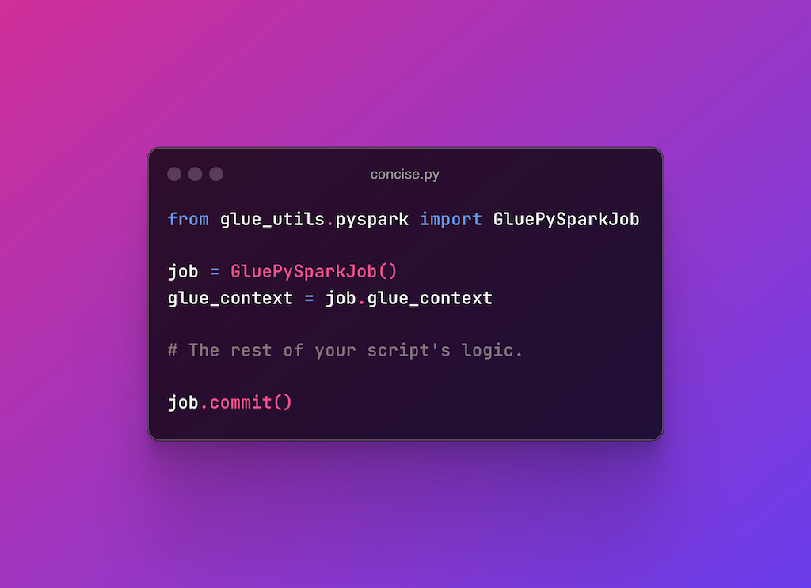

# glue-utils

[](https://pypi.org/project/glue-utils/)
[](https://pypistats.org/packages/glue-utils)
[](LICENSE)

[](https://github.com/dashmug/glue-utils/actions/workflows/ci.yml)
[](https://github.com/dashmug/glue-utils/actions/workflows/github-code-scanning/codeql)
[](https://github.com/dashmug/glue-utils/actions/workflows/dependabot/dependabot-updates)

[](https://sonarcloud.io/summary/overall?id=dashmug_glue-utils)
[](https://sonarcloud.io/summary/overall?id=dashmug_glue-utils)
[](https://sonarcloud.io/summary/overall?id=dashmug_glue-utils)
[](https://sonarcloud.io/summary/overall?id=dashmug_glue-utils)
[](https://sonarcloud.io/summary/overall?id=dashmug_glue-utils)
[](https://sonarcloud.io/summary/overall?id=dashmug_glue-utils)

`glue-utils` is a Python library designed to enhance the developer experience when working with AWS Glue ETL and Python Shell jobs. It reduces boilerplate code, increases type safety, and improves IDE auto-completion, making Glue development easier and more efficient.



- [Usage in AWS Glue](#usage-in-aws-glue)
- [Usage when developing jobs locally](#usage-when-developing-jobs-locally)
- [Main Features](#main-features)
  - [`BaseOptions`](#baseoptions)
  - [`GluePySparkContext`](#gluepysparkcontext)
  - [`GluePySparkJob`](#gluepysparkjob)
- [Other features](#other-features)

## Usage in AWS Glue

To use `glue-utils` in AWS Glue, it needs to be added as an
[additional python module](https://docs.aws.amazon.com/glue/latest/dg/aws-glue-programming-python-libraries.html#addl-python-modules-support)
in your Glue job.

You can do this by adding an `--additional-python-modules` job parameter
with the value, `glue_utils==0.11.2`. For more information about setting
job parameters, see [AWS Glue job parameters](https://docs.aws.amazon.com/glue/latest/dg/aws-glue-programming-etl-glue-arguments.html).

## Usage when developing jobs locally

This library does not include `pyspark` and `aws-glue-libs` as
dependencies as they are already pre-installed in Glue's runtime
environment.

To help in developing your Glue jobs locally in your IDE, it is helpful
to install `pyspark` and `aws-glue-libs`. Unfortunately, `aws-glue-libs`
is not available through PyPI so we can only install it from its git
repository.

```sh
# Glue 5.0 uses PySpark 3.5.4
pip install pyspark==3.5.4
pip install git+https://github.com/awslabs/aws-glue-libs.git@master
pip install glue-utils
```

## Main Features

- `BaseOptions`
  - a dataclass that parses the options supplied via command-line
    arguments
- `GluePySparkContext`
  - a subclass of `awsglue.context.GlueContext` that adds convenient
    type-safe methods (methods that ensure the correct data types are
    used) for the most common connection types.
- `GluePySparkJob`
  - a convenient class that simplifies and reduces the boilerplate
    code needed in Glue jobs.

### `BaseOptions`

`BaseOptions` resolves the required arguments into a dataclass to help
your IDE auto-complete and detect potential `KeyError`s. It also makes
type checkers such as `pyright` and `mypy` detect those errors at
design or build time instead of at runtime.

```python
from dataclasses import dataclass
from glue_utils import BaseOptions


@dataclass
class Options(BaseOptions):
    start_date: str
    end_date: str


args = Options.from_sys_argv()

print(f"The day partition key is: {args.start_date}")
```

_Note: Similar to the behavior of `awsglue.utils.getResolvedOptions`,
all arguments are **strings**. A warning is raised when defining a field as
other data types. We aim to auto-cast those values in the future._

### `GluePySparkContext`

`GluePySparkContext` is a subclass of
[`awsglue.context.GlueContext`](https://docs.aws.amazon.com/glue/latest/dg/aws-glue-api-crawler-pyspark-extensions-glue-context.html)
with the following additional convenience methods for creating and
writing `DynamicFrame`s for the common connection types. The method
signatures ensure that you are passing the right connection options
and/or format options for the chosen connection type.

- MySQL
  - `create_dynamic_frame_from_mysql`
  - `write_dynamic_frame_to_mysql`
- Oracle
  - `create_dynamic_frame_from_oracle`
  - `write_dynamic_frame_to_oracle`
- PostgreSQL
  - `create_dynamic_frame_from_postgresql`
  - `write_dynamic_frame_to_postgresql`
- SQL Server
  - `create_dynamic_frame_from_sqlserver`
  - `write_dynamic_frame_to_sqlserver`
- S3
  - JSON
    - `create_dynamic_frame_from_s3_json`
    - `write_dynamic_frame_to_s3_json`
  - CSV
    - `create_dynamic_frame_from_s3_csv`
    - `write_dynamic_frame_to_s3_csv`
  - Parquet
    - `create_dynamic_frame_from_s3_parquet`
    - `write_dynamic_frame_to_s3_parquet`
  - XML
    - `create_dynamic_frame_from_s3_xml`
    - `write_dynamic_frame_to_s3_xml`
- DynamoDB
  - `create_dynamic_frame_from_dynamodb`
  - `create_dynamic_frame_from_dynamodb_export`
  - `write_dynamic_frame_to_dynamodb`
- Kinesis
  - `create_dynamic_frame_from_kinesis`
  - `write_dynamic_frame_to_kinesis`
- Kafka
  - `create_dynamic_frame_from_kafka`
  - `write_dynamic_frame_to_kafka`
- OpenSearch
  - `create_dynamic_frame_from_opensearch`
  - `write_dynamic_frame_to_opensearch`
- DocumentDB
  - `create_dynamic_frame_from_documentdb`
  - `write_dynamic_frame_to_documentdb`
- MongoDB
  - `create_dynamic_frame_from_mongodb`
  - `write_dynamic_frame_to_mongodb`

### `GluePySparkJob`

`GluePySparkJob` reduces the boilerplate code needed by using reasonable
defaults while still allowing for customizations by passing keyword
arguments.

In its simplest form, it takes care of instantiating
`awsglue.context.GlueContext` and initializing `awsglue.job.Job`.

```python
from glue_utils.pyspark import GluePySparkJob

# Instantiate with defaults.
job = GluePySparkJob()

# This is the SparkContext object.
sc = job.sc

# This is the GluePySparkContext(GlueContext) object.
glue_context = job.glue_context

# This is the SparkSession object.
spark = job.spark

# The rest of your job's logic.

# Commit the job if necessary (e.g. when using bookmarks).
job.commit()
```

#### `options_cls`

You may pass a subclass of `BaseOptions` to make the resolved options
available in `job.options`.

```python
from dataclasses import dataclass
from glue_utils import BaseOptions
from glue_utils.pyspark import GluePySparkJob


@dataclass
class Options(BaseOptions):
    # Specify the arguments as field names
    start_date: str
    end_date: str
    source_path: str


# Instantiate with the above Options class.
job = GluePySparkJob(options_cls=Options)

# Use the resolved values using the fields available in job.options.
print(f"The S3 path is {job.options.source_path}")
```

#### `log_level`

You may configure the logging level. It is set to `GluePySparkJob.LogLevel.WARN` by
default.

```python
from glue_utils.pyspark import GluePySparkJob


# Log only errors.
job = GluePySparkJob(log_level=GluePySparkJob.LogLevel.ERROR)
```

#### `spark_conf`

You may set Spark configuration values by instantiating a custom
`pyspark.SparkConf` object to pass to `GluePySparkJob`.

```python
from pyspark import SparkConf
from glue_utils.pyspark import GluePySparkJob

# Instantiate a SparkConf and set the desired config keys/values.
spark_conf = SparkConf()
spark_conf.set("spark.driver.maxResultSize", "4g")

# Instantiate with the above custom SparkConf.
job = GluePySparkJob(spark_conf=spark_conf)
```

#### `glue_context_options`

You may set options that are passed to `awsglue.context.GlueContext`.

```python
from glue_utils.pyspark import GlueContextOptions, GluePySparkJob

job = GluePySparkJob(glue_context_options={
    "minPartitions": 2,
    "targetPartitions": 10,
})

# Alternatively, you can use the GlueContextOptions TypedDict.
job = GluePySparkJob(glue_context_options=GlueContextOptions(
    minPartitions=2,
    targetPartitions=10,
)
```

## Other features

The following modules contain useful `TypedDict`s for defining
connection options or format options to pass as arguments to various
`awsglue.context.GlueContext` methods:

- `glue_utils.pyspark.connection_options`
  - for defining `connection_options` for various connection types
- `glue_utils.pyspark.format_options`
  - for defining `format_options` for various formats
